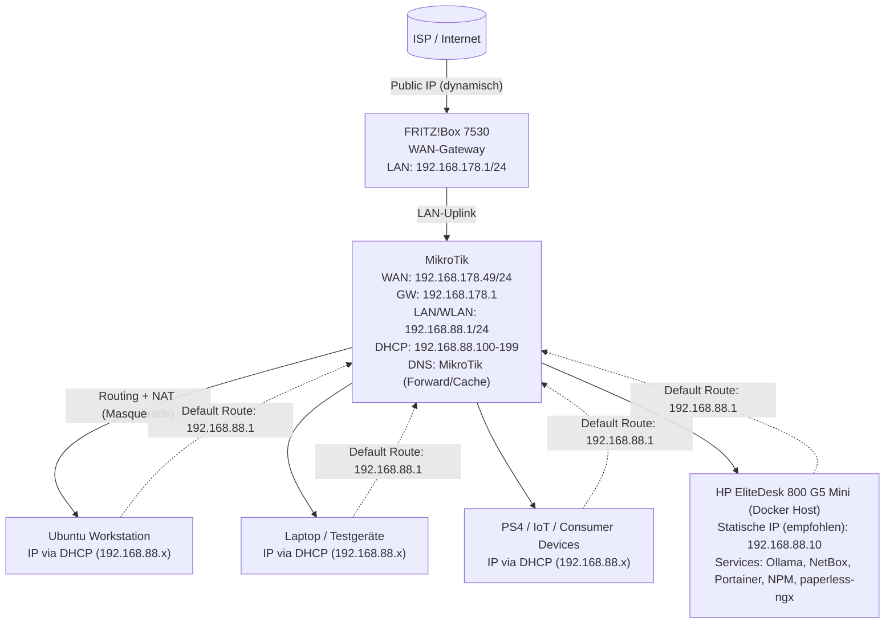
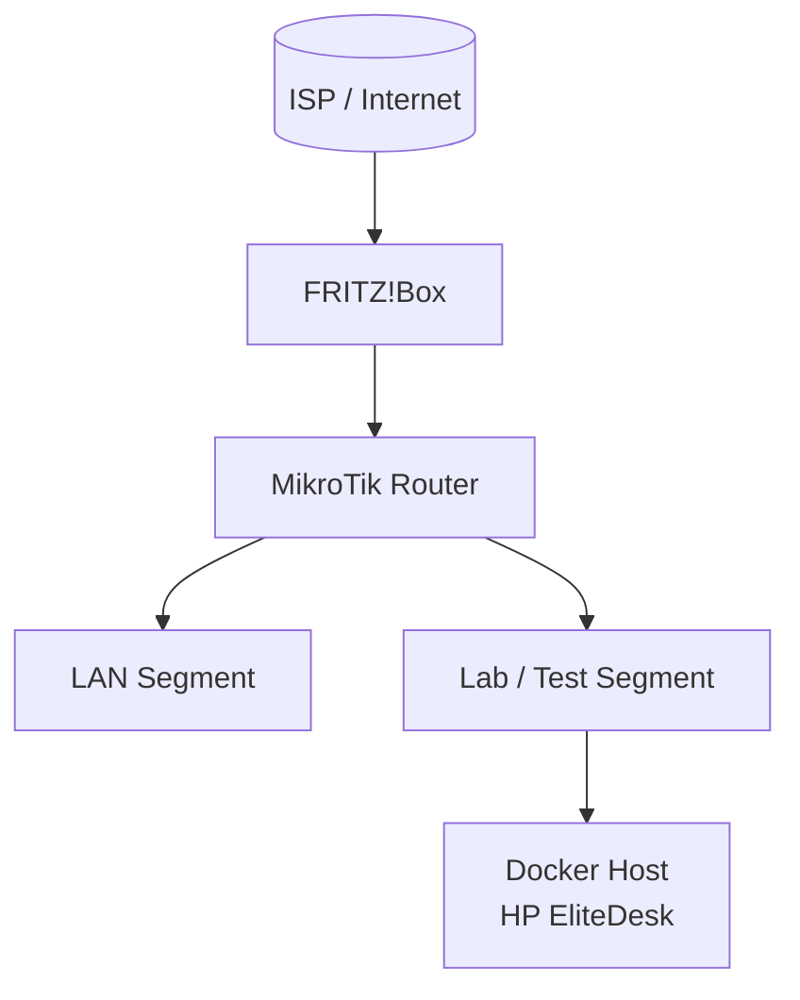

# Netzwerk-Topologie (Mermaid-Diagramm)

Dieses Diagramm stellt die aktuelle High-Level-Architektur des HomeLabs dar.

---

> **Anonymisierungshinweis (Repo/Public):** Öffentliche IP/Anbieter-Zugangsdaten nie dokumentieren. Interne RFC1918-Netze (z. B. 192.168.x.x) sind normalerweise unkritisch, aber Hostnamen/Ports/öffentliche DynDNS-Namen ggf. als Platzhalter schreiben.

---

## Architekturprinzip

* Die FRITZ!Box übernimmt ausschließlich die WAN-Anbindung.
* Der MikroTik ist zentrale Routing- und Sicherheitsinstanz.
* Clients befinden sich vollständig hinter dem MikroTik.

---

## Optional: Erweiterung (zukünftig geplant)

Beispiel für mögliche Erweiterungen:

Dieses erweiterte Diagramm kann genutzt werden, sobald weitere Netzsegmente oder Services hinzukommen.
