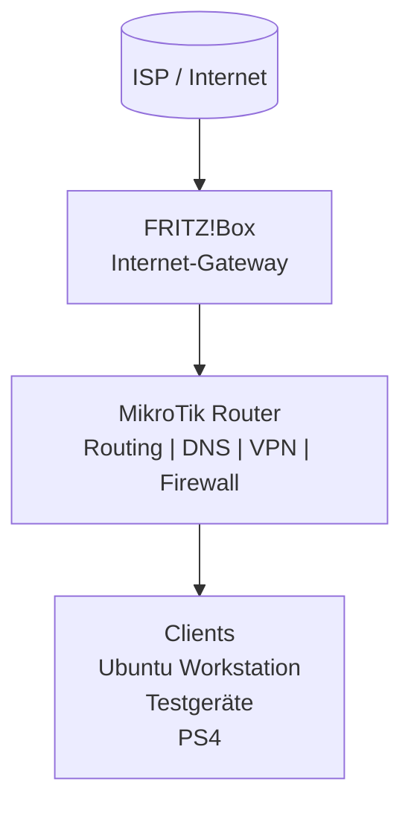
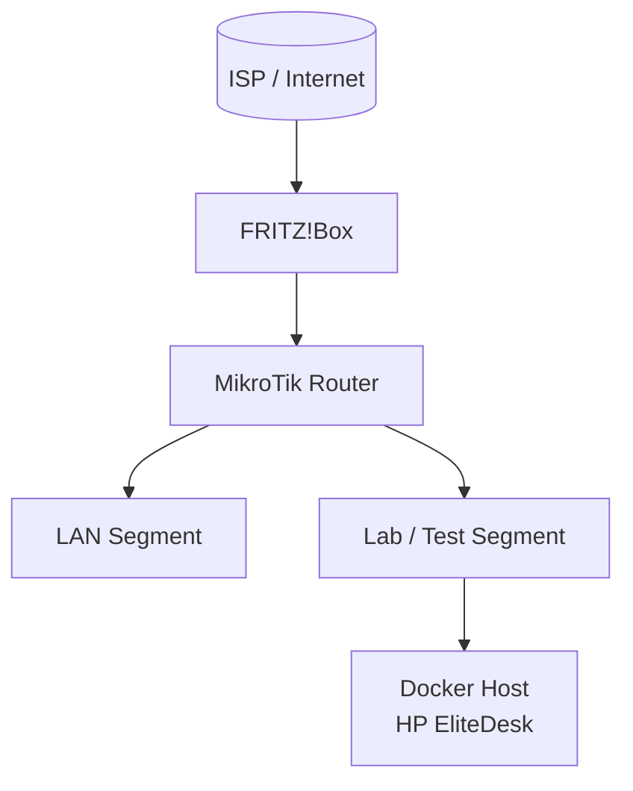

# Netzwerk-Topologie (Mermaid-Diagramm)

Dieses Diagramm stellt die aktuelle High-Level-Architektur des HomeLabs dar.

---

---

## Architekturprinzip

* Die FRITZ!Box übernimmt ausschließlich die WAN-Anbindung.
* Der MikroTik ist zentrale Routing- und Sicherheitsinstanz.
* Clients befinden sich vollständig hinter dem MikroTik.

---

## Optional: Erweiterung (zukünftig geplant)

Beispiel für mögliche Erweiterungen:

Dieses erweiterte Diagramm kann genutzt werden, sobald weitere Netzsegmente oder Services hinzukommen.
